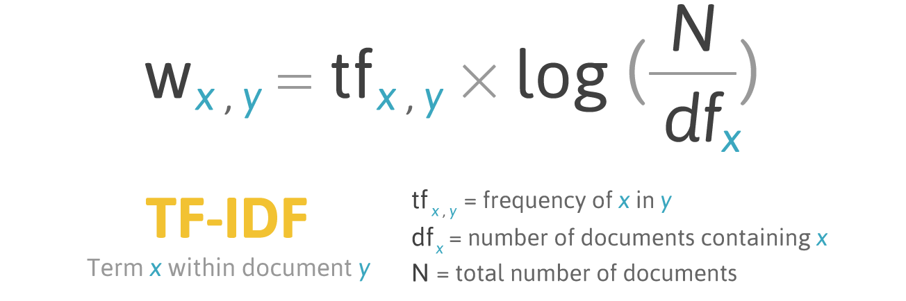

```{r, include = F}
library(quanteda)
library(quanteda.textplots)
library(quanteda.textstats)
library(topicmodels)
library(dplyr)
library(stringi)
library(magrittr)
library(Matrix)
library(irlba)
library(hunspell)
library(haven)


subcontracts <- read_dta("M:/Xiaoqing/Subcontracting/forNLP_2.dta")
x_raw <- subcontracts$subaward_description
x_raw[is.na(x_raw)] <- ""

```

First, this is cleaning the text to remove non-Latin characters, trimming white space, and encoding in ASCII.

```{r, warning = F, message = F}

x <- x_raw %>%
  stri_trans_general("Any-Latin; Latin-ASCII") %>%
  iconv(to = "ASCII//TRANSLIT", sub = " ") %>%
  gsub("[^A-Za-z0-9'\\-\\s]", " ", ., perl = TRUE) %>%
  gsub("\\s+", " ", ., perl = TRUE) %>%
  trimws()

```

Below, I turn the text vector into a corpus object. Corpus objects are used for further text processing, it is essentially the same but each observation is called a document, and any non-text columns are document variables. Then I tokenize the corpus, which means breaking the list of text into pieces, here each token will be a word. I am removing numbers, codes in the form ##-##, non-english words, and stopwords. Stopwords are words like like "and" or "to' that have little semantic meaning. I also remove words that occur at a frequency of less than 1 word per 10000 across the corpus, which keeps the data from being too large to run.

I turn the tokens into a document feature matrix, where the rows are documents again and the columns are tokens/feature. The sum of a row will equal the number of tokens in a document, so any row entry represents a word observation in one of the documents. This is a large sparse matrix. Here is an example:

Doc 1: "Assembly of Aircraft Parts"

Doc 2: "See Description"

| Document | Assembly  | Parts | Description  | NATO |
|----------|-----------|-------|--------------|------|
| 1        | 1         | 1     | 0            | 0    |
| 2        | 0         | 0     | 1            | 0    |

Often, these are normalized so the row sums to 1.

```{r, warning = F, message = F}

corp <- corpus(x, docnames = as.character(seq_along(x)))
toks <- tokens(corp, remove_punct = TRUE, remove_numbers = TRUE, remove_symbols = TRUE) %>%
  tokens_tolower() %>%
  tokens_remove(pattern = ".*\\d.*", valuetype = "regex") %>%               
  tokens_keep(pattern = "^[a-z](?:[a-z']+|-?[a-z']+)*$", valuetype = "regex") %>% 
  tokens_select(stopwords("en"), selection = "remove") %>%
  tokens_select(min_nchar = 3)

dfm_raw  <- dfm(toks)
dfm_kept <- dfm_trim(dfm_raw, min_termfreq = 0.00001, termfreq_type = "prop")
dfm_kept <- dfm_kept[ntoken(dfm_kept) > 0, ]

feats <- featnames(dfm_kept)
eng   <- hunspell_check(feats, dict = dictionary("en_US"))
dfm_kept <- dfm_kept[, feats[eng]]
dfm_kept <- dfm_kept[ntoken(dfm_kept) > 0, ]


```

Next, I compute TF-IDF weights on the sparse DFM. TF-IDF scales each token by its frequency within a document and down-weights tokens that appear in many documents, so ubiquitous words like “assembly” have less influence than rarer, more informative terms. I run the irlba command which turns the sparse matrix into a dense matrix, needed for the k means computation.

{width="492"}

I run k means clustering to find document clusters. The idea is that we randomly initialize k (\<n) cluster centers in the feature space. Think about each document as a vector whose components are given by the token frequency values from the document term matrix. So, we assign every document to the nearest cluster center (or centroid) by minimizing the squared Euclidean distance. Then, after all documents have been assigned a cluster, the new cluster centers will be recomputed as the average of the points assigned to it, and the process repeats until the changes in new cluster centers are very small. So in this clustering method we find 1. the local optimum, which may or may not be globlal, this is dependent on our randomly initialized values and 2. documents are assigned to mutually exclusive groups, but the tokens emblematic of those groups could be shared. For ex., groups 1 and 2 may both very commonly have the word "assembly" and are distinguished by other tokens.

Changing the K parameter will allow you to change the number of clusters. 

```{r, warning = F}

tfidf <- dfm_tfidf(dfm_kept)
A <- as(tfidf, "dgCMatrix")


set.seed(98)
n_comp <- 120
sv <- irlba::prcomp_irlba(A, n = n_comp, center = FALSE, scale. = FALSE)
Z  <- sv$x

K <- 4
km <- kmeans(Z, centers = K, nstart = 25)
docvars(dfm_kept, "cluster") <- factor(km$cluster, levels = 1:K)


```

Next we want to find the most important words from each cluster, which is used for the wordcloud. We test whether each token t is over represented in cluster C compared to all other documents. So, the null hypothesis is that the frequency of t in C is the same inside the cluster as outside.

We use the $G^2$ statistic:

$$
G^2 = 2 \sum_{\text{cells}} O \,\log\!\left(\frac{O}{E}\right)
$$

where O is the observed count in a cell and E is the expected count under independence- (row\*col/N). There are 4 cells, which cover :

|           | token t | not t  |
|-----------|---------|--------|
| in C      | a       | c      |
| not in C  | b       | d      |

So if token t is independent of cluster C, then (O/E) will be roughly 1, and log(1) = 0 so the G statistic will show no significance. When t is over represented, G will be positive, and when t is underrepresented, negative.

```{r, warning = F}


top_n   <- 25
clusters <- levels(docvars(dfm_kept, "cluster"))
key_list <- lapply(clusters, function(cl) {
  tgt <- docvars(dfm_kept, "cluster") == cl
  ks  <- textstat_keyness(dfm_kept, target = tgt, measure = "lr")
  out <- head(ks[order(-ks$G2), c("feature","G2")], top_n)
  out$cluster <- cl
  out
})
top_distinctive <- do.call(rbind, key_list)[, c("cluster","feature","G2")]

feats2 <- unique(top_distinctive$feature)
M <- matrix(0, nrow = length(clusters), ncol = length(feats2),
            dimnames = list(clusters, feats2))
for (i in seq_along(clusters)) {
  sub <- subset(top_distinctive, cluster == clusters[i])
  M[i, sub$feature] <- pmax(sub$G2, 0)
}
comp_dfm <- quanteda::as.dfm(M)
docnames(comp_dfm) <- rep("", ndoc(comp_dfm))
textplot_wordcloud(comp_dfm, comparison = TRUE, max_words = 200, label_size = 0)

top_distinctive


```
